# 芝罘区 A 地块生成式规划复现项目 MECE 全局地图

> 这份文档的目的不是再增加一层复杂度，而是把已经散开的论文、案例、代码、Rhino/Grasshopper、日照、容积率、文保、退线等内容重新收成一个不重不漏的系统。

## 0. 一句话总控

这个项目不是单纯复现原论文，也不是单纯做啤酒厂地块方案。

它的准确定位是：

> 将原论文“环境性能驱动的生成式设计方法”迁移到烟台芝罘区真实地块，以 A 地块 low-FAR 方案为首轮案例，建立一套“真实约束输入 - 形体候选生成 - 环境性能评估 - 指标筛选 - 汇报输出”的可复现流程。

因此现在不要再用“我有没有完整复现论文”来判断项目成败，而要用下面这条线判断：

> 真实地块资料是否被转译成约束，候选体量是否能被批量生成，指标是否能被计算和对比，最终是否能讲出一个 A 地块 low-FAR 的案例故事。

## 1. MECE 总分解

这个项目可以不重不漏地拆成 7 个模块。

```mermaid
flowchart TB
    P["项目总目标<br/>芝罘区 A 地块 low-FAR 案例化复现"]

    P --> A["A. 论文方法层<br/>要复现的理论流程"]
    P --> B["B. 真实案例层<br/>烟台啤酒厂/芝罘区地块"]
    P --> C["C. 数据资产层<br/>原始资料与中间数据"]
    P --> D["D. 技术流水线层<br/>Python/GIS/Rhino/GH/Ladybug"]
    P --> E["E. 指标评价层<br/>硬约束 + 优化目标 + 解释指标"]
    P --> F["F. 当前成果层<br/>24 候选 + 8 个日照闭环"]
    P --> G["G. 交付叙事层<br/>报告/图纸/表格/代码目录"]

    A --> A1["pix2pix/GAN 或规则生成"]
    A --> A2["Octopus/多目标优化"]
    A --> A3["Ladybug/环境性能评价"]

    B --> B1["A 地块: 首轮重点"]
    B --> B2["B 地块: 文保/文化设施, 首轮弱化"]
    B --> B3["环山路/南山公园/周边建筑"]

    C --> C1["规划条件/DWG/文保 PDF/图像/照片"]
    C --> C2["边界/退线/保护范围/可建区"]
    C --> C3["候选模型/评估 CSV/汇总 JSON"]

    D --> D1["预处理脚本"]
    D --> D2["Rhino 模型"]
    D --> D3["Grasshopper 参数化"]
    D --> D4["Ladybug 日照批算"]
    D --> D5["结果合并与可视化"]

    E --> E1["硬约束: 不满足即不可行"]
    E --> E2["优化目标: 越大/越小越好"]
    E --> E3["解释指标: 用来讲故事"]

    F --> F1["24 个候选体量"]
    F --> F2["8 个正式日照结果"]
    F --> F3["FAR + 日照合并表"]

    G --> G1["方法流程图"]
    G --> G2["案例约束图"]
    G --> G3["方案指标表"]
    G --> G4["代表方案图"]
```

这 7 类互相不要混：

- 论文方法层回答“我借用了什么方法”。
- 真实案例层回答“这个方法被放到哪个现实地块”。
- 数据资产层回答“我手上有什么文件和中间数据”。
- 技术流水线层回答“文件怎么变成结果”。
- 指标评价层回答“结果怎么判断好坏”。
- 当前成果层回答“现在已经能交付什么”。
- 交付叙事层回答“怎么给客户/论文读者讲清楚”。

## 2. 论文、案例、代码的关系

最容易乱的地方，是把“论文原流程”“现实案例”“你已经做出来的代码/模型”混成一件事。实际上它们是三层映射。

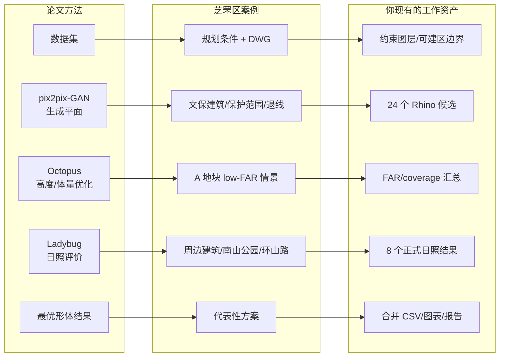

关键理解：

- 原论文提供的是“方法骨架”，不是必须 1:1 复制的现实地块。
- 芝罘区 A 地块提供的是“工程化验证场景”，不是训练数据全集。
- 你现有的 Rhino/GH/脚本结果提供的是“可交付证据链”，不是抽象概念。

## 3. 当前项目最清晰的任务边界

### 本轮必须做

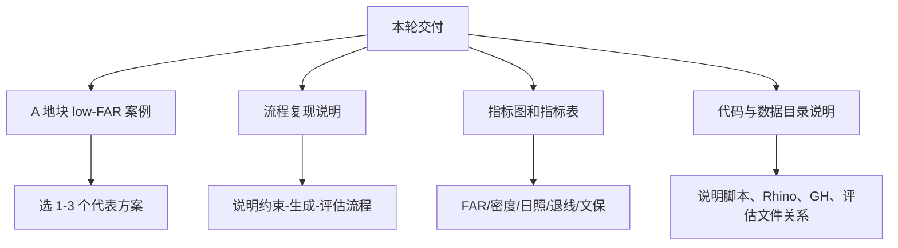

### 本轮不要做成主任务

- 不要把高容积率情景作为首轮重点。
- 不要把 B 地块作为主案例。
- 不要强行补齐完整 GAN 训练闭环。
- 不要把通风、热、能源、碳排放全部做成实算指标。
- 不要再从零追问“这到底是不是原论文复现”，它现在是“方法迁移复现”。

### 可以保留为创新后手

- 第二性能维度：通风、热环境、能源、碳排放四选一。
- 高低容积率能力：方法层保留，案例层只展示 A 地块 low-FAR。
- 更多样本：莱山/福山/高新区作为补充数据，不作为首轮主线。

## 4. 案例空间对象 MECE

所有空间对象可以分成 5 类。每一类在模型里的作用不同，不能混。

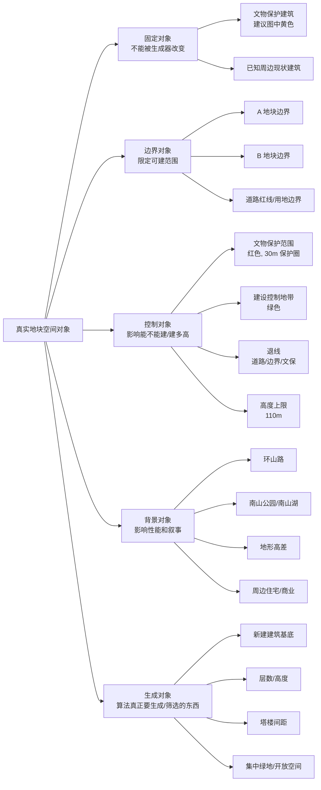

最重要的判断：

- 文物建筑不是生成对象，而是固定对象、保护对象、评价对象。
- A 地块新建体量才是生成对象。
- 环山路和南山公园主要是背景与退界/景观叙事对象。
- 保护范围和退线是硬约束，不是审美偏好。

## 5. 核心概念字典

| 概念 | 最短定义 | 在本项目中的角色 | 典型表达 |
|---|---|---|---|
| A 地块 | 首轮主案例地块 | 生成和评估主体 | low-FAR 案例 |
| B 地块 | 文保/文化设施相关地块 | 首轮弱化或占位 | 不作为主交付 |
| 文物保护建筑 | 醴泉公司旧址/啤酒厂旧址 | 固定对象, 黄色表达 | 不拆、不改、不侵入 |
| 保护范围 | 文保建筑外墙以外约 30m | 硬约束 | 红色范围 |
| 建设控制地带 | 文物周边受控建设区 | 条件约束 | 绿色范围 |
| 退线 | 建筑离道路/边界/文保的最小距离 | 硬约束 | 退环山路、退边界 |
| 容积率 FAR | 总计容建筑面积 / 用地面积 | 强度指标 | low-FAR 或法定 FAR |
| 建筑密度 coverage | 建筑基底面积 / 用地面积 | 平面占地指标 | 约 20% |
| 绿地率 | 绿地面积 / 用地面积 | 环境和规划指标 | 不低于 30% |
| 日照时数 | 指定时间范围内接收到日照的小时数 | 环境性能指标 | sun_hours_avg/min |
| 日照间距 | 为满足日照要求形成的建筑间距 | 硬约束 + 解释指标 | 高层之间/对周边 |
| 约束违规率 | 违反退线、文保、密度等规则的比例 | 建议替代“退化率” | penalty/violation_rate |
| 地块激励 | 生成时吸引或排斥建筑布置的空间权重 | 生成引导图层 | 靠路入口、避让文保、面向公园 |

关于会议记录里的“退化率”：建议不要直接叫“退化率”，容易像遗传算法术语。更清楚的写法是：

> 约束违规率，表示候选方案中违反退线、文物保护范围、密度或日照底线的程度。

## 6. 指标评价 MECE

指标不要混成一锅。它们分三类：硬约束、优化目标、解释指标。

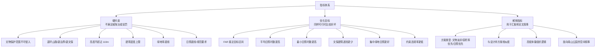

### 指标方向

| 指标 | 方向 | 说明 |
|---|---:|---|
| FAR | 接近目标最好 | 不是越高越好；low-FAR 情景有单独目标 |
| 建筑密度 | 不超过上限 | 过高会压缩绿地和日照 |
| 绿地率 | 越高越好, 但需满足开发强度 | 不能只为了绿地牺牲所有建筑量 |
| 退线违规面积 | 越小越好 | 最好为 0 |
| 文保冲突面积 | 必须为 0 | 红线级硬约束 |
| 平均日照时数 | 越高越好 | 代表整体环境表现 |
| 最小日照时数 | 越高越好 | 代表最差点是否太差 |
| 对周边遮挡 | 越低越好 | 尤其是住宅/文保/集中绿地 |
| 约束违规率 | 越低越好 | 用来综合筛掉不靠谱方案 |

## 7. low-FAR 与法定 FAR 的矛盾怎么收口

这是项目天然让你绝望的地方之一：客户口径与法定指标不是同一条线。

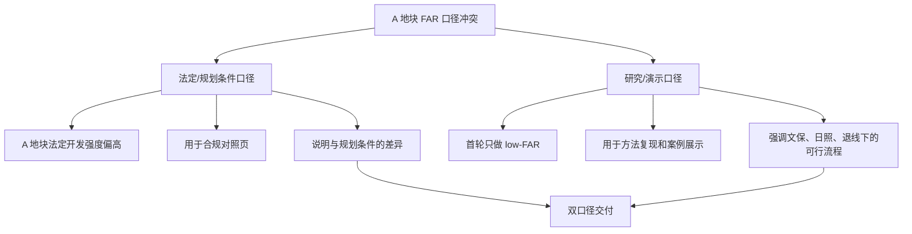

推荐写法：

> 方法层面保留高低容积率方案生成能力；但本轮案例受文物保护、退界和阶段性汇报目标影响，优先展示 A 地块 low-FAR 情景。法定规划强度作为对照口径单独说明，不作为本轮主要优化目标。

这样就不会被“法定 FAR 偏高，但客户又要 low-FAR”卡死。

## 8. 技术流水线 MECE

把所有代码、Rhino、Grasshopper、Ladybug 都放到同一条流水线里看，它们各自的责任就清楚了。

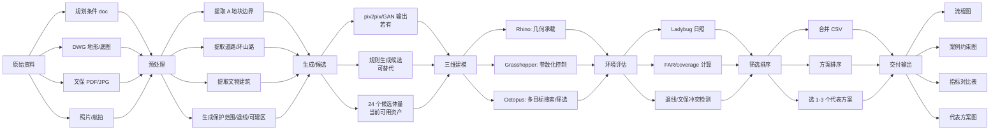

### 各工具职责

| 工具/脚本 | 它负责什么 | 它不负责什么 |
|---|---|---|
| Python/GIS 脚本 | 提取边界、整理 CSV、计算 FAR/密度、合并结果 | 不负责真正的 3D 视觉表达 |
| Rhino | 承载 3D 几何、查看体量、出图 | 不负责批量逻辑本身 |
| Grasshopper | 参数化控制基底、高度、层数、候选批量生成 | 不负责论文叙事 |
| Octopus | 多目标搜索或筛选候选 | 不负责证明文保合理性 |
| Ladybug | 日照/环境性能模拟 | 不负责容积率合法性 |
| 报告脚本 | 汇总指标、生成图表、写入报告 | 不负责重新设计方案 |

如果真实项目里 Octopus 没有完整跑成主引擎，可以这样收口：

> 本研究保留 Octopus/多目标优化的流程框架，并在当前阶段采用批量候选 + 指标筛选方式完成 A 地块 low-FAR 子集闭环。

这比硬说“完整多目标进化算法已闭环”更稳。

## 9. 数据资产地图

当前数据分两类：本地可见资产、远程/历史整理资产。

### 本地可见资产

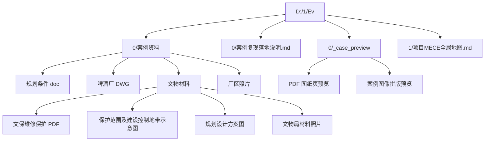

### 远程/历史整理资产

这些来自你贴出的总控摘要，本环境未直接挂载，需要在原工作目录中核对。

| 资产 | 摘要中的路径 | 作用 |
|---|---|---|
| 总控说明 | `/mnt/d/Code/Env/Ev_001_work/06_report/refs/Env.md` | 需求与口径总控 |
| 规划条件 | `/mnt/d/Code/Env/Ev_001_work/01_raw/planning_doc/site_conditions_02015.doc` | 法定指标与退线 |
| DWG | `/mnt/d/Code/Env/Ev_001_work/01_raw/dwg/site_20180709.dwg` | 地块底图 |
| 文保 PDF | `/mnt/d/Code/Env/Ev_001_work/01_raw/heritage/liquan_heritage_restoration_plan.pdf` | 文物建筑信息 |
| 文保范围图 | `/mnt/d/Code/Env/Ev_001_work/01_raw/heritage/protection_scope_control_zone.jpg` | 保护/控制范围 |
| 可建区边界 | `/mnt/d/Code/Env/Ev_001_work/02_gis/boundary/buildable_area_A.dxf` | A 地块可建区 |
| 24 候选摘要 | `/mnt/d/Code/Env/Ev_001_work/04_rhino_gh/batch24_pipeline/06_logs/phase_f_ready_summary.json` | 候选体量已齐 |
| 日照总表 | `/mnt/d/Code/Env/Ev_001_work/05_eval/daylight/daylight_batch_summary.json` | FAR/批量汇总 |
| 8 方案合并表 | `/mnt/d/Code/Env/Ev_001_work/05_eval/daylight/subset8_paperflow_20260602/subset8_batch24_eval_merged.csv` | 第一轮可展示闭环 |

## 10. 当前成果应该如何被理解

你不是“什么都乱”，而是已有资产处在不同成熟度。

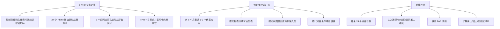

第一轮最稳交付不是“完整 24 个全性能优化”，而是：

> 8 个正式日照结果 + FAR/密度/退线/文保说明 + 1-3 个代表方案。

这已经是一个案例闭环。

## 11. A 地块 low-FAR 案例的最小闭环

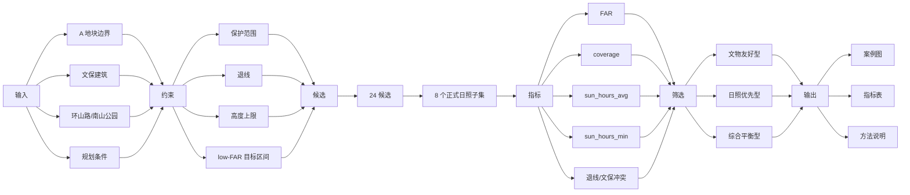

这就是当前项目应该追求的“最小但完整”的闭环。

## 12. 图件体系 MECE

图不要乱堆。建议只按 5 类图组织。

| 图类 | 作用 | 内容 |
|---|---|---|
| 方法流程图 | 解释论文方法如何迁移 | 数据输入 - 约束图层 - 生成 - Rhino/GH - 日照 - 筛选 |
| 案例约束图 | 解释真实地块 | 环山路、南山公园、A/B 地块、文保建筑黄色、保护范围、退线 |
| 候选方案图 | 展示生成能力 | 24 个或 8 个候选缩略图 |
| 性能评价图 | 证明不是只看形式 | 日照假彩色、sun_hours 图、指标散点/柱状图 |
| 代表方案图 | 最终讲故事 | 1-3 个方案，配指标和设计解释 |

客户记录里的“保护性建筑 黄色”就放在“案例约束图”里，不要放到所有图里重复解释。

## 13. 第二性能维度怎么放才不失控

你客户提了通风、热、能源、碳排放，但首轮不应该全部实算。它们的 MECE 放法如下。

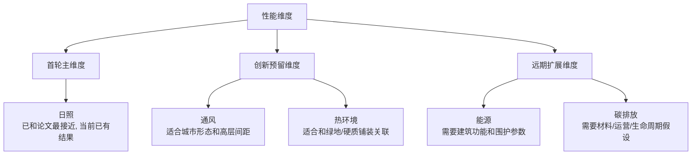

建议顺序：

1. 首轮只把日照做实。
2. 第二维度优先选通风或热环境，因为它们和城市形态关系最直接。
3. 能源和碳排放先作为未来展望，不要现在硬塞进实算。

## 14. 最容易混乱的 8 个问题

| 混乱点 | 正确归位 |
|---|---|
| “复现论文”是不是必须完全一样 | 不是，是方法迁移复现 |
| 文物建筑是不是要生成 | 不是，是固定保护对象 |
| A 地块是不是必须做到法定高 FAR | 首轮不是，法定 FAR 做对照说明 |
| 24 个候选是不是都必须完成日照 | 首轮不必须，8 个子集可形成闭环 |
| GAN 没有完整训练是不是失败 | 不一定，可写成既有模型/规则候选/批量生成的工程验证 |
| Octopus 没完全跑起来怎么办 | 可写成多目标筛选框架，当前采用批量候选指标筛选 |
| 第二性能维度必须现在做吗 | 不必须，作为创新后手 |
| 退化率是什么 | 建议改成约束违规率或惩罚项 |

## 15. 报告叙事骨架

可以把最终说明写成 6 段。

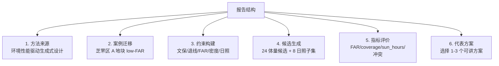

一段可直接使用的总述：

> 本研究以原论文中的环境性能驱动生成式设计方法为基础，将其迁移至烟台芝罘区 A 地块真实城市更新场景。由于该地块同时受到文物保护范围、建设控制地带、道路退线、建筑密度、容积率和日照要求的共同约束，研究重点并非追求单一高开发强度，而是在 low-FAR 情景下验证“约束输入 - 候选生成 - 环境评价 - 指标筛选”的可复现流程。现阶段基于 24 个 Rhino 候选体量与 8 个正式日照评估结果，形成可用于案例汇报的指标化比较与代表方案筛选。

## 16. 现在最该冻结的 3 个参数

如果这 3 个不冻结，项目会继续发散。

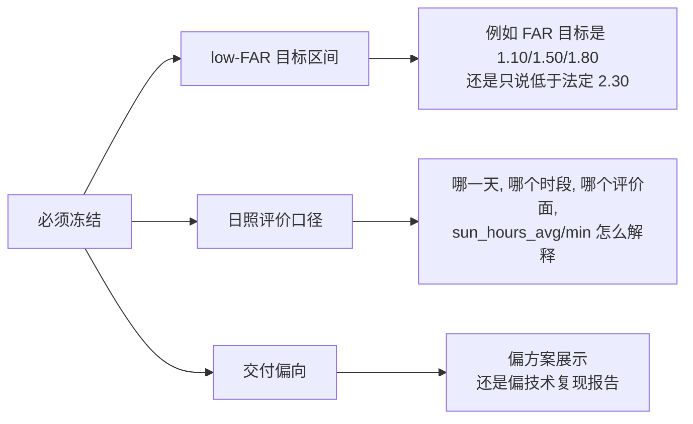

建议默认冻结为：

- low-FAR：先按“低于法定 FAR 2.30 的研究演示情景”表述，不强行指定唯一数值。
- 日照：先使用已经完成的 8 个正式日照结果口径，报告中如实说明模拟日期和时段。
- 交付：偏“技术复现 + 案例展示”的混合型，不做纯方案册。

## 17. 你现在的心理模型

如果把项目想成数值优化，它其实仍然是你熟悉的东西，只是变量藏在建筑语言里。

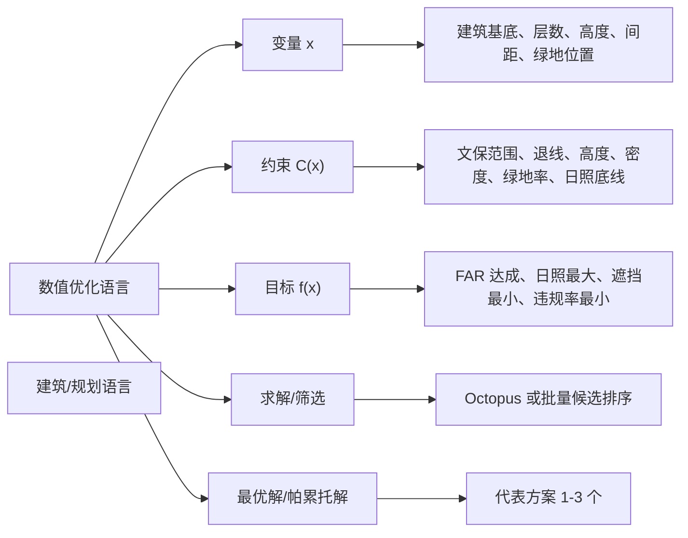

你原来的思路没有错。只是现实案例把变量、约束、目标拆散在 Word、PDF、DWG、Rhino、GH、CSV、图纸和客户话术里。现在要做的不是重新发明项目，而是把它们重新对齐。

## 18. 一页版结论

- 论文是方法来源：pix2pix/GAN + Octopus + Ladybug。
- 案例是迁移场景：烟台芝罘区 A 地块。
- 首轮交付是 low-FAR，不是高 FAR 全开发。
- 文物建筑是固定保护对象，不是生成对象。
- 核心硬约束是文保、退线、高度、密度、绿地率、日照底线。
- 核心评价指标是 FAR、coverage、sun_hours_avg、sun_hours_min、约束违规率。
- 当前最可靠成果是 24 个候选 + 8 个日照子集 + 合并指标表。
- 第二性能维度先作为创新预留，不要现在全面展开。
- 最终要交付的是一个案例故事：真实地块如何被转译成约束，候选如何生成，指标如何筛选，为什么选出这些代表方案。

